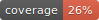

# Qualifire Python SDK

<div align="center">

[](https://pypi.org/project/qualifire/)
[](https://pypi.org/project/qualifire/)
[](https://github.com/qualifire-dev/qualifire-python-sdk/actions/workflows/build.yml)
[](https://github.com/qualifire-dev/qualifire/blob/main/LICENSE)


**Evaluate LLM outputs for quality, safety, and reliability**

[Documentation](https://docs.qualifire.ai) · [Dashboard](https://app.qualifire.ai) · [PyPI](https://pypi.org/project/qualifire/)

</div>

---

## Table of Contents

- [Installation](#installation)
- [Quick Start](#quick-start)
- [Available Checks](#available-checks)
- [Usage Examples](#usage-examples)
- [Configuration](#configuration)
- [Response Format](#response-format)

## Installation

```bash
pip install qualifire
```

## Quick Start

```python
from qualifire.client import Client

client = Client(api_key="your_api_key")

result = client.evaluate(
    input="What is the capital of France?",
    output="The capital of France is Paris.",
    hallucinations_check=True,
)

print(f"Score: {result.score}")  # 0-100
print(f"Flagged: {result.evaluationResults[0].results[0].flagged}")
```

## Available Checks

| Check | Description |
|-------|-------------|
| `hallucinations_check` | Detect factual inaccuracies or hallucinations |
| `grounding_check` | Verify output is grounded in the provided context |
| `pii_check` | Detect personally identifiable information |
| `prompt_injections` | Identify prompt injection attempts |
| `content_moderation_check` | Check for harmful content (harassment, hate speech, dangerous content, sexual content) |
| `tool_use_quality_check` | Evaluate quality of tool/function calls |
| `syntax_checks` | Validate output syntax (JSON, SQL, etc.) |
| `assertions` | Custom assertions to validate against the output |

## Usage Examples

### Basic Input/Output Evaluation

```python
result = client.evaluate(
    input="Summarize this document about climate change.",
    output="Climate change is primarily caused by human activities...",
    hallucinations_check=True,
    grounding_check=True,
)
```

### Message-Based Evaluation

Evaluate full conversation histories using the OpenAI message format:

```python
from qualifire.types import LLMMessage

result = client.evaluate(
    messages=[
        LLMMessage(role="system", content="You are a helpful assistant."),
        LLMMessage(role="user", content="What is the capital of France?"),
        LLMMessage(role="assistant", content="The capital of France is Paris."),
    ],
    hallucinations_check=True,
)
```

### Multi-Turn Conversations

Enable multi-turn mode for evaluating conversation context:

```python
result = client.evaluate(
    messages=[
        LLMMessage(role="user", content="What is 2 + 2?"),
        LLMMessage(role="assistant", content="2 + 2 equals 4."),
        LLMMessage(role="user", content="And if you add 3 more?"),
        LLMMessage(role="assistant", content="4 + 3 equals 7."),
    ],
    hallucinations_check=True,
    grounding_multi_turn_mode=True,
)
```

### Content Safety

```python
result = client.evaluate(
    input="Write a story about friendship.",
    output="Once upon a time...",
    content_moderation_check=True,
    pii_check=True,
    prompt_injections=True,
)
```

### Syntax Validation

```python
from qualifire.types import SyntaxCheckArgs

result = client.evaluate(
    input="Return the user data as JSON.",
    output='{"name": "John", "age": 30}',
    syntax_checks={"json": SyntaxCheckArgs(args="strict")},
)
```

### Custom Assertions

Define natural language assertions to validate against:

```python
result = client.evaluate(
    input="List three fruits.",
    output="1. Apple\n2. Banana\n3. Orange",
    assertions=[
        "The output must contain exactly three items",
        "Each item must be a fruit",
        "Items must be numbered",
    ],
)
```

### Tool Selection Quality

Evaluate whether the LLM selected the right tools with correct arguments:

```python
from qualifire.types import LLMMessage, LLMToolCall, LLMToolDefinition

result = client.evaluate(
    messages=[
        LLMMessage(role="user", content="What's the weather in New York tomorrow?"),
        LLMMessage(
            role="assistant",
            content="Let me check that for you.",
            tool_calls=[
                LLMToolCall(
                    id="call_123",
                    name="get_weather",
                    arguments={"location": "New York", "date": "tomorrow"},
                )
            ],
        ),
    ],
    available_tools=[
        LLMToolDefinition(
            name="get_weather",
            description="Get weather forecast for a location",
            parameters={
                "type": "object",
                "properties": {
                    "location": {"type": "string"},
                    "date": {"type": "string"},
                },
                "required": ["location"],
            },
        ),
    ],
    tool_use_quality_check=True,
)
```

### Pre-configured Evaluations

Run evaluations configured in the [Qualifire Dashboard](https://app.qualifire.ai):

```python
result = client.invoke_evaluation(
    evaluation_id="eval_abc123",
    input="User query here",
    output="LLM response here",
)
```

### Model Modes

Control the speed/quality trade-off for each check:

```python
from qualifire.types import ModelMode

result = client.evaluate(
    input="...",
    output="...",
    hallucinations_check=True,
    hallucinations_mode=ModelMode.QUALITY,  # SPEED | BALANCED | QUALITY
    grounding_check=True,
    grounding_mode=ModelMode.SPEED,
)
```

## Configuration

### Environment Variables

| Variable | Description |
|----------|-------------|
| `QUALIFIRE_API_KEY` | Your Qualifire API key |
| `QUALIFIRE_BASE_URL` | Custom API base URL (optional) |

### Client Options

```python
client = Client(
    api_key="your_api_key",  # Or set QUALIFIRE_API_KEY env var
    base_url="https://...",  # Custom base URL (optional)
    debug=True,              # Enable debug logging
    verify=True,             # SSL certificate verification
)
```

## Response Format

```python
result = client.evaluate(...)

# Overall score (0-100)
result.score

# Evaluation status
result.status

# Detailed results per check
for item in result.evaluationResults:
    print(f"Check: {item.type}")
    for r in item.results:
        print(f"  {r.name}: {r.label} (score: {r.score})")
        print(f"  Reason: {r.reason}")
        print(f"  Flagged: {r.flagged}")
```

<details>
<summary>Example JSON Response</summary>

```json
{
  "score": 95,
  "status": "completed",
  "evaluationResults": [
    {
      "type": "hallucinations",
      "results": [
        {
          "name": "hallucination_check",
          "label": "pass",
          "score": 100,
          "flagged": false,
          "reason": "The response is factually accurate and consistent with known information.",
          "claim": "The capital of France is Paris.",
          "quote": "The capital of France is Paris.",
          "confidence_score": 98
        }
      ]
    }
  ]
}
```

</details>

## Requirements

- Python 3.8+

## License

MIT License - see [LICENSE](LICENSE) for details.
